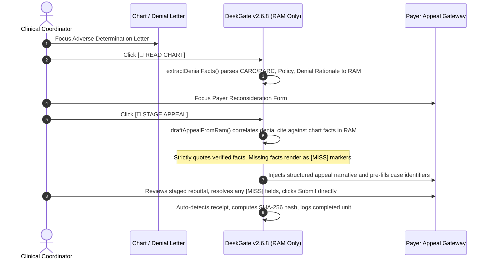

# DeskGate Operator Extension — v2.6.8 (Client Runtime)

> **"We stage quoted-fact appeals on written-off payer denials. Industry planning figures put most denials in the un-appealed pile. Your coordinator still hits Submit."**

[](https://developer.chrome.com/docs/extensions/mv3/intro/)
[](https://deskgate.app)
[](https://deskgate.app/readiness)
[](LICENSE)
[-purple.svg)](https://deskgate.app/master-terms)

DeskGate is the sovereign client-side runtime for **adverse determination appeals**, denial rebuttals, attachment collation, and residual prior authorization (PA).

This repository contains the **client-side operator workstation extension**. It mounts inside the coordinator’s authenticated Chrome session to stage quoted-fact rebuttals on payer portals (Availity, CoverMyMeds, UnitedHealthcare) from live DOM inventory, then halt. Submit stays on the coordinator.

---

## 🎯 Why This Exists: The CMS-0057-F & Denial Gap

Federal mandate **CMS-0057-F** requires impacted government plans to expose FHIR Prior Authorization APIs by **January 1, 2027**.

However, the statutory rule legally exempts or excludes the majority of administrative friction:

1. **Self-Funded ERISA Employer Plans (~65% of covered US workers):** Statutorily exempt from CMS title authority. Payer portals and manual entry remain permanent.
2. **Specialty and Pharmacy Prior Auths (e.g., GLP-1s like Wegovy):** Excluded from the API provisions; step-therapy documentation stays manual.
3. **Clinical Review Handoffs:** The API only transmits structured requests. When a case is pended, clinical chart notes and attachments must still be collated and uploaded by hand.
4. **The Denial & Appeal Abyss:** CMS-0057-F has no mandate for reconsideration workflows. Denials, rebuttals, and peer-to-peer disputes remain 100% manual portal labor.

```mermaid
flowchart LR
Req["Prior Authorization Request"] --> Rule{"CMS-0057-F Governed?"}

Rule -- "Yes: Gov Plans (MA, Medicaid, QHP)" --> API["2027 FHIR API<br/>(Clean Electronic Exchange)"]
API --> Rev{"Pended / Denied?"}
Rev -- "Clean Approval" --> Done["Instant Decision"]
Rev -- "Pended or Denied" --> Resid

Rule -- "No: ERISA Self-Funded (~65% US Workers)<br/>and Pharmacy Drugs (GLP-1s / Biologics)" --> Resid["Non-API Residual Portal Labor<br/>(Availity, CoverMyMeds, UHC, State MMIS)"]

subgraph DG["DeskGate Operator Runtime"]
Stage["1. Live Staging (⚡ STAGE PORTAL)"]
Appeal["2. Quoted Rebuttal (📝 STAGE APPEAL)"]
Gate["3. Mandatory Human Submit Gate"]
Ledger["4. 14-Day Schedule M Ledger"]

Stage --> Gate
Appeal --> Gate
Gate --> Ledger
end

Resid --> Stage
Resid --> Appeal

style Req fill:#0f172a,stroke:#38bdf8,stroke-width:1px,color:#f8fafc
style Rule fill:#0f172a,stroke:#38bdf8,stroke-width:1.5px,color:#f8fafc
style API fill:#0f172a,stroke:#475569,stroke-width:1px,color:#f8fafc
style Rev fill:#0f172a,stroke:#475569,stroke-width:1px,color:#f8fafc
style Done fill:#0f172a,stroke:#475569,stroke-width:1px,color:#f8fafc
style Resid fill:#451a03,stroke:#f59e0b,stroke-width:1.5px,color:#fef3c7
style Stage fill:#083344,stroke:#00e5ff,stroke-width:1.5px,color:#e0f2fe
style Appeal fill:#3b0764,stroke:#c084fc,stroke-width:1.5px,color:#f5d0fe
style Gate fill:#1e1b4b,stroke:#a855f7,stroke-width:2px,color:#f5d0fe
style Ledger fill:#064e3b,stroke:#00ff41,stroke-width:1.5px,color:#dcfce7
style DG fill:#020617,stroke:#00e5ff,stroke-width:1.5px,color:#38bdf8
```



---

## ⚡ Quoted Denial & Reconsideration Engine

The most severe operational drain on revenue cycle management is **first-pass denial recovery**.

When a payer issues an adverse determination (e.g., *"insufficient duration of conservative therapy"*, *"failed trial dates missing"*), standard LLMs hallucinate medical necessity or invent policy citations, creating severe compliance and fraud exposure.

DeskGate’s **STAGE APPEAL** facility introduces an auditable, hallucination-proof reconsideration workflow:



Invariants:

- **Zero Hallucinated Necessity:** The engine strictly extracts and quotes dates, dosages, and trial outcomes already held in volatile memory from the chart.
- **Explicit `[MISS]` Integrity:** If the payer requests a trial date or lab outcome not found in RAM, DeskGate writes an explicit `[MISS — {key} not in RAM]` warning and leaves that portal box empty. It never invents evidence.
- **Mid-Shaft Legal Boundary:** DeskGate stages the administrative collation; the human coordinator verifies the rebuttal and submits on the portal.

---

## 🛡️ Core Operational & Diligence Invariants

### 1. HIPAA Zero-Retention Mode (ZRM)

- **Volatile RAM Storage:** Under the ZRM tri-factor check (Enterprise Plan + Executed BAA + Volatile RAM), private API keys are purged from `chrome.storage.local` and held strictly in session memory. Closing the extension destroys all credentials.
- **Hash-Only Telemetry:** Payer tracking references and transaction IDs are hashed via **browser-side SHA-256** prior to transmission. Raw patient identifiers, member IDs, and chart notes never touch DeskGate infrastructure.
- **BAA Chain Routing:** Live vision / reasoning calls route through BAA-covered channels. Google Cloud HIPAA BAA is executed (Vertex AI, tenant `deskgate-production`, 28 Sep 2026). Anthropic remains available only on a covered enterprise BAA. Volatile RAM. Zero model training on customer data.

### 2. The Non-Negotiable Human Gate

DeskGate stages repetitive portal fields in under two seconds, then **halts**. The extension refuses autonomous submission (`Submit`, `File`, `Affirm`, `Send`). The licensed coordinator reviews the staged packet and clicks Submit directly on the payer portal. **Zero unauthorized autonomous filings. Zero clinical liability transfer.**

### 3. Pilot Ops Governance (Schedule M)

Embedded directly in the operator console:

- **Certified Baseline (`pc_baseline`):** Captures historical cases/day per coordinator to establish empirical labor recovery.
- **12-Point Readiness Gate:** In-console audit checklist verifying executive P&L sponsorship, frozen cohorts, rollback procedures, and failure thresholds (<55% gate accept).
- **Spear of Medicine Scope:** Hardcoded boundary restricting the software to administrative staging (Mid-Shaft), legally excluding medical necessity determinations (Tip).

---

## 💻 Installation and Quickstart

Production floors should **not** use Developer mode. Force-install the signed CRX.

### Prerequisites

- Google Chrome or Microsoft Edge (Manifest v3, v116+)
- For a locked floor: Intune / Google Admin / GPO so Developer mode stays off

### 1. Production install (no Developer mode)

Extension ID (stable across 2.6.4 → 2.6.8; same packing key):

```
bdhbnbpkkcageebgfabcecolflgembfe
```

1. Host `deskgate-operator-2.6.8.crx` and `updates.xml` on HTTPS (`https://deskgate.app/ext/`).
2. Push one force-install line:

```
bdhbnbpkkcageebgfabcecolflgembfe;https://deskgate.app/ext/updates.xml
```

3. Leave Developer mode **off**. Coordinators pin the action and open CONFIG.

Full Intune / Edge / Chrome policy steps: [`IT_FORCE_INSTALL.md`](IT_FORCE_INSTALL.md).

### 2. Fallback — Developer Mode Load (unmanaged pilot seats only)

1. Clone or download this repository:

```bash
git clone https://github.com/deskgate-app/deskgate-operator-2.6.8-public.git
```

*(Alternatively: click **Code** → **Download ZIP**, then extract the directory).*

2. In Chrome, open `chrome://extensions`.
3. Enable **Developer mode** (top-right toggle).
4. Click **Load unpacked** and select the extracted folder.
5. In the extension details card, enable **Allow access to file URLs** (required to run the offline simulation suite).

Do not use this path for a 200-seat rollout.

### 2. Configuration (30 Seconds)

1. Click the DeskGate toolbar icon to open the Side Panel.
2. Click **CONFIG**:
   - Set **Backend Host URL**: `https://deskgate.app` (or your local backend).
   - Paste the **Desk key** DeskGate issued to your desk. It names the desk and its lane: the payer portal and chart sites agreed before the test. The panel shows both, refuses to read or stage on any other site, and sends every screen read to Google Cloud (Vertex AI, `deskgate-production`) whatever engine is selected. Rows on `/pilot` are filed under the desk the key names.
   - Internal runs without a desk key: enter a **Desk Code** (default `DG-INTERNAL`) and select an engine. Anthropic and xAI are for synthetic pages only.
   - (Optional) Check the **HIPAA / ZRM** boxes to purge disk keys into volatile RAM.
3. Click **Save Configuration**.
4. Optional: open **PILOT OPS** and lock sponsor, named coordinators, and certified baseline before Day 1.

---

## 🔬 Offline Simulation Suite

Standalone pages included in this repository to exercise the complete operator loop without live payer credentials and without live PHI:

| Specimen | Clinical Purpose | Operator Action |
| :--- | :--- | :--- |
| `showcase-chart.html` | Outpatient specialist chart (Vargas, Elena M.) | **READ CHART** |
| `showcase-portal.html` | Commercial prior-auth form | **STAGE PORTAL** |
| `showcase-denial.html` | Adverse determination letter (policy ORT-PT-2026) | **READ CHART** |
| `showcase-appeal.html` | Reconsideration form | **STAGE APPEAL** |

Workflow is documented in `SIMULATION_WALKTHROUGH.md`.

---

## 🔒 What a Hospital CISO / RCM Compliance Officer Should Inspect

| Verification Area | Implementation |
| :--- | :--- |
| Workstation Storage | `saveKey()` and `purgePhiFromDisk()` in `sidepanel.js`. Toggling ZRM purges `chrome.storage.local` PHI keys into volatile RAM. |
| Screen Sensing Scope | `captureDisplayGlassBase64()`. `getDisplayMedia` prompts the OS picker, captures one frame, and immediately stops tracks. |
| Human Gate | `isIrreversibleControl()` in `content.js`. Submit / File / Affirm / button controls are blocked. Inventory query excludes submit/button types. |
| Telemetry Sanitization | `postPilotEvent()` in `sidepanel.js`. Tracking IDs are SHA-256 hashed in the browser before `/api/pilot-event`. Raw IDs, names, and notes are not sent. |
| Appeal Integrity | `draftAppealFromRam()` in `lanes.js`. Quotes RAM only. Missing keys stay `[MISS]`. |

---

## 📊 The 14-Day Schedule M Measurement Protocol

DeskGate licenses software under Schedule S and substantiates economic value under Schedule M:

- **Throughput Denominator:** Completed cases per coordinator-day vs certified historical baseline (`pc_baseline`).
- **Completed Unit:** Human-confirmed portal submission paired with an auto-logged confirmation reference (hash only).
- **Material-Edit Audit:** Coordinator modifications after staging (target: ≥70% zero-edit acceptance).
- **Labor Output:** Coordinator-days recovered per 1,000 cases.

`LEDGER.csv` is the offline fallback if the panel cannot reach the host. See `FOURTEEN_DAYS.md`.

---

## 🏛️ Issuer and Corporate Governance

- **Entity:** DeskGate, Inc. (Delaware C-Corporation)
- **Founders:** Hans Johannes Schulte (Systems & Product Architect) & Jolanda C. M. Wevers Schulte (Operations & Governance)
- **Corporate Address:** 16192 Coastal Highway, Lewes, DE 19958, USA
- **Contact:** [hans@deskgate.app](mailto:hans@deskgate.app) · +1 (302) 244-7953
- **License:** Client extension code in this package is licensed under the [MIT License](LICENSE). Commercial backend APIs at https://deskgate.app, trademarks, lane licensing, and Business Associate obligations are not covered by MIT. See `NOTICE` and [Master Terms](https://deskgate.app/master-terms).
